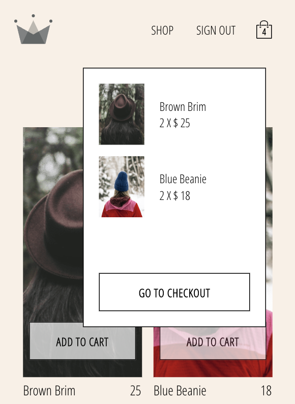

# demoda 購物網 - 一站買齊你的時尚配件 🛍🛒

> 以 React 框架建構，搭配 Redux 狀態管理，firebase 三方登入功能，帶給你流暢的購物體驗！

## [see live](https://yuwen-demoda.netlify.app/) 🔆

## 操作流程 ☝

### 1. 進入首頁

  

 

### 2. 登入頁，可選擇 google 帳號快速登入

  

 

### 3. 瀏覽商品，放入購物車

  

 

### 4. 查看購物車商品

  

 

### 5. 進到結帳頁面

  

 

### 6. 可編修商品數量

  

 

## 特點 🔩

### 前端

- UI components 只負責接收、顯示資料
- redux 資料管理方式：reducer 只負責存 raw data，商業邏輯在 selector 才加入
- 使用 `Reselect` 避免觸發多餘 render
- 使用 `redux-persist`，在 user 重新載入頁面時，保留購物車資料
- 使用 `redux-thunk`，將非同步的邏輯完全由 redux 控制，做到 logic separation

### 後端

- 使用 firebase authentication 服務來做三方登入
- 使用 firestore 資料庫，儲存使用者資料、購物網的商品資料

## 使用技術 🛠

✨ 使用 React 作為前端框架

- 語法類似 javascript，元件各自獨立且可重複使用。

✨ 使用 Redux 做狀態管理

- 將 function 與資料拆分，方便管理及利於 scale，生態系豐富。

✨ 使用 Redux-Thunk 做 async 的狀態管理

- 完全將狀態管理交給 reducer，UI component 只需要接收資料。

✨ 使用 React-Hooks

- 將元件中的邏輯獨立拆分，閱讀性較高。

✨ 使用 React-Router 達到路由功能

- declarative，配置容易，可讀性高。

✨ 利用 Firebase authentication 做三方登入

- 使用者不需註冊，提升體驗。

✨ 利用 Firestore 資料庫儲存使用者資料、購物網的商品資料

- 無需自行建立後端及資料庫，快速打造資料庫功能。

✨ 使用 Redux-Persist 記住購物車物品

- 可設定黑名單及白名單。

✨ styled component 做出 css 效果

- CSS in javacscript，避免全域的 css 衝突，可傳參數控制樣式。

✨ 部署在 Netlify

- 與 github 同步，只要推送到特定分支，即可自動部署。
